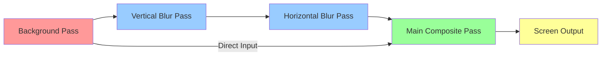
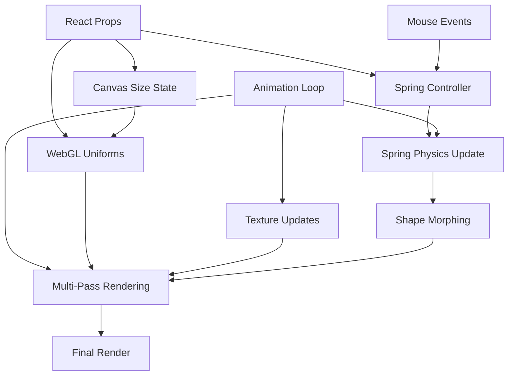

# Liquid Glass v2 - Architecture & Design Documentation

## Executive Summary

The `liquid-glass-v2` component is a sophisticated WebGL2-based visual effect system that creates realistic glass-like morphing effects in real-time. It combines advanced computer graphics techniques including multi-pass rendering, physically-based refraction, Gaussian blur, and spring physics to deliver a fluid, organic user interface element.

## 🏗️ High-Level Architecture

### Core Design Principles

1. **Multi-Pass Rendering Pipeline**: Complex effects are broken down into discrete rendering passes that build upon each other
2. **Physically-Based Effects**: Glass properties use real physics equations for refraction, Fresnel effects, and light behavior
3. **Performance-First**: GPU-accelerated rendering with optimized shader programs and efficient resource management
4. **Declarative API**: Visual parameters are controlled through React props with automatic GPU synchronization
5. **Spring Physics**: Smooth, natural mouse interactions using damped spring systems

### Component Hierarchy

```
liquid-glass-v2/
├── index.tsx                    # Main React component & API
├── impl/lib/                   # Core rendering system
│   ├── index.ts               # Public API exports
│   └── impl/                  # Implementation details
│       ├── renderer/          # WebGL rendering classes
│       ├── utils.ts          # Texture & blur utilities
│       └── useResizeObserver.ts
├── impl/shaders/              # GLSL shader source code
│   ├── vertex.ts             # Fullscreen quad vertex shader
│   ├── fragment-bg.ts        # Background rendering
│   ├── fragment-bg-vblur.ts  # Vertical blur pass
│   ├── fragment-bg-hblur.ts  # Horizontal blur pass
│   └── fragment-main.ts      # Glass effects composite
└── impl/types/               # TypeScript type definitions
    └── lib.ts
```

## 🎨 Rendering Pipeline

### 4-Pass Rendering System

The liquid glass effect is achieved through a carefully orchestrated 4-pass rendering pipeline:



#### Pass 1: Background Rendering (`fragment-bg.ts`)
- **Purpose**: Renders the background scene with shadow effects
- **Inputs**: Background texture/video, shadow parameters
- **Outputs**: High-precision RGBA16F color buffer
- **Key Features**:
  - Shadow generation based on shape geometry
  - Background texture mapping with aspect ratio preservation
  - Support for static images and live video

#### Pass 2: Vertical Blur (`fragment-bg-vblur.ts`)
- **Purpose**: Applies Gaussian blur in the vertical direction
- **Inputs**: Background pass output texture
- **Outputs**: Vertically blurred background
- **Algorithm**: Uses precomputed Gaussian kernel weights for optimal performance

#### Pass 3: Horizontal Blur (`fragment-bg-hblur.ts`)
- **Purpose**: Completes the 2D Gaussian blur by blurring horizontally
- **Inputs**: Vertical blur pass output
- **Outputs**: Fully blurred background texture
- **Note**: Separable blur implementation for O(n) instead of O(n²) complexity

#### Pass 4: Glass Effects Composite (`fragment-main.ts`)
- **Purpose**: Renders the final glass effect with all visual properties
- **Inputs**: Original background + blurred background textures
- **Outputs**: Final composited image to screen
- **Effects Applied**:
  - Shape morphing with signed distance fields (SDFs)
  - Physically-based refraction with chromatic dispersion
  - Fresnel reflections for realistic glass edges
  - Directional glare effects
  - Color tinting and transparency

## 🔬 Technical Deep Dive

### WebGL2 Rendering System

#### Core Classes

1. **`MultiPassRenderer`** - Orchestrates the complete pipeline
   - Manages render pass execution order
   - Handles inter-pass texture dependencies
   - Provides global uniform management

2. **`RenderPass`** - Individual rendering stage
   - Encapsulates shader program and framebuffer
   - Manages fullscreen quad rendering
   - Handles texture binding and uniform setting

3. **`ShaderProgram`** - WebGL shader management
   - Automatic uniform and attribute detection
   - Type-safe uniform setting with WebGL type mapping
   - Proper resource cleanup and error handling

4. **`FrameBuffer`** - Off-screen rendering target
   - High-precision RGBA16F color attachments
   - Depth buffer support for complex scenes
   - Efficient resize handling

### Mathematical Foundations

#### Shape Definition with Signed Distance Fields (SDFs)

The glass shapes are defined using mathematically precise SDFs that enable:
- **Smooth Blending**: Multiple shapes merge organically using smooth minimum functions
- **Perfect Edges**: Infinite precision for crisp boundaries
- **Normal Calculation**: Surface normals derived mathematically for lighting

```glsl
// Core SDF functions
float sdCircle(vec2 p, float r) { return length(p) - r; }
float roundedRectSDF(vec2 p, vec2 center, float width, float height, float cornerRadius, float n)
float smin(float a, float b, float k)  // Smooth minimum for blending
```

#### Physics-Based Refraction

The refraction model uses Snell's law and geometric optics:

```glsl
// Calculate refraction angle based on surface normal and material properties
float thetaI = asin(pow(x_R_ratio, 2.0));
float thetaT = asin(1.0 / u_refFactor * sin(thetaI));
float edgeFactor = -1.0 * tan(thetaT - thetaI);
```

This produces physically accurate light bending that responds to:
- Glass thickness (`u_refThickness`)
- Refractive index (`u_refFactor`)
- Surface curvature (calculated from SDF normals)

#### Spring Physics System

Mouse tracking uses a damped spring system for natural movement:

```typescript
// Spring force equation: F = -k*x - c*v
const ax = dx * this.stiffness - this.velocity.x * this.damping;
const ay = dy * this.stiffness - this.velocity.y * this.damping;
```

**Benefits**:
- Eliminates jarring mouse movements
- Creates organic, fluid feel
- Velocity feedback drives shape morphing

### Performance Optimizations

#### GPU-Side Optimizations
1. **Separable Blur**: O(n) complexity instead of O(n²)
2. **Precomputed Kernels**: Gaussian weights calculated once on CPU
3. **High-Precision Framebuffers**: RGBA16F for accurate intermediate results
4. **Texture Reuse**: Efficient binding and unbinding strategies

#### CPU-Side Optimizations
1. **Memoized Calculations**: React hooks prevent unnecessary recalculations
2. **Batch Uniform Updates**: Minimize GPU state changes
3. **Efficient Spring Physics**: Optimized integration with frame rate independence
4. **Resource Management**: Proper cleanup prevents memory leaks

## 🎛️ Configuration & Customization

### Visual Parameter Categories

#### Shape Properties
- `shapeWidth`, `shapeHeight`: Base dimensions
- `shapeRadius`: Corner roundness (0-100)
- `shapeRoundness`: Corner curve smoothness
- `mergeRate`: How shapes blend together

#### Physics Interaction
- `springStiffness`: Responsiveness to mouse movement
- `springDamping`: Smoothness of motion
- `springSizeFactor`: Velocity-based shape morphing

#### Glass Optical Properties
- `refractionFactor`: Material refractive index
- `refractionDispersion`: Chromatic aberration amount
- `refractionFresnelRange`: Edge reflection behavior

#### Visual Effects
- `blurRadius`: Background blur amount
- `glareAngle`: Light reflection direction
- `tint`: Glass color overlay

### Advanced Usage Patterns

#### Custom Background Sources
```typescript
// Static image
<LiquidGlass backgroundImage="/path/to/image.jpg" />

// Live video
<LiquidGlass backgroundVideo={videoElement} />

// Solid color background
<LiquidGlass backgroundType={1} />
```

#### Performance Tuning
```typescript
// High-DPI displays
<LiquidGlass dpr={window.devicePixelRatio} />

// Reduced blur for performance
<LiquidGlass blurRadius={20} />

// Debug visualization
<LiquidGlass debugStep={3} />
```

## 🔄 Data Flow & State Management

### React State Flow



### Uniform Synchronization

The system maintains two categories of uniforms:

1. **Global Uniforms**: Shared across all rendering passes
   - Resolution, DPR, mouse position
   - Shape dimensions and physics state
   - Blur parameters and weights

2. **Pass-Specific Uniforms**: Unique to individual passes
   - Background textures and settings
   - Glass optical properties
   - Debug visualization flags

## 🛠️ Development Guidelines

### Adding New Visual Effects

1. **Identify Rendering Stage**: Determine which pass should handle the effect
2. **Update Shader**: Add necessary uniforms and calculations to GLSL code
3. **Extend Props Interface**: Add React props for user control
4. **Update Uniform Mapping**: Ensure values reach the GPU correctly
5. **Document Parameters**: Add comments explaining the effect

### Performance Considerations

1. **Shader Complexity**: Keep fragment shader operations minimal
2. **Texture Size**: Balance quality vs. performance for framebuffers
3. **Uniform Updates**: Batch changes to minimize GPU state transitions
4. **Memory Management**: Always dispose of WebGL resources properly

### Browser Compatibility

- **Minimum**: WebGL2 support (Chrome 56+, Firefox 51+, Safari 15+)
- **Required Extensions**: `EXT_color_buffer_float` for high-precision rendering
- **Fallback Strategy**: Graceful degradation when WebGL2 unavailable

## 🎯 Future Enhancement Opportunities

### Short-term Improvements
1. **Shader Hot Reload**: Development-time shader editing
2. **Performance Profiler**: Built-in GPU timing analysis
3. **Accessibility**: Reduced motion and prefers-reduced-motion support
4. **Touch Interaction**: Mobile device gesture support

### Advanced Features
1. **Multiple Glass Objects**: Independent shapes with different properties
2. **3D Glass Effects**: Depth-based interactions and layering
3. **Procedural Textures**: Generated backgrounds for enhanced visual variety
4. **Audio Reactivity**: Music-driven animation parameters

### Architectural Evolution
1. **WebGPU Migration**: Next-generation graphics API adoption
2. **Compute Shaders**: Advanced physics simulation on GPU
3. **Ray Tracing**: Hardware-accelerated realistic reflections
4. **VR/AR Support**: Immersive glass interface elements

## 📋 Conclusion

The `liquid-glass-v2` component represents a sophisticated fusion of computer graphics, physics simulation, and user interface design. Its multi-layered architecture enables both powerful visual effects and maintainable code, while its performance optimizations ensure smooth real-time interaction.

The modular design allows for continuous enhancement while maintaining backward compatibility, making it a robust foundation for advanced visual interface elements in modern web applications.

---

*This architecture serves as both implementation reference and future development guide, ensuring consistent evolution of the liquid glass effect system.*