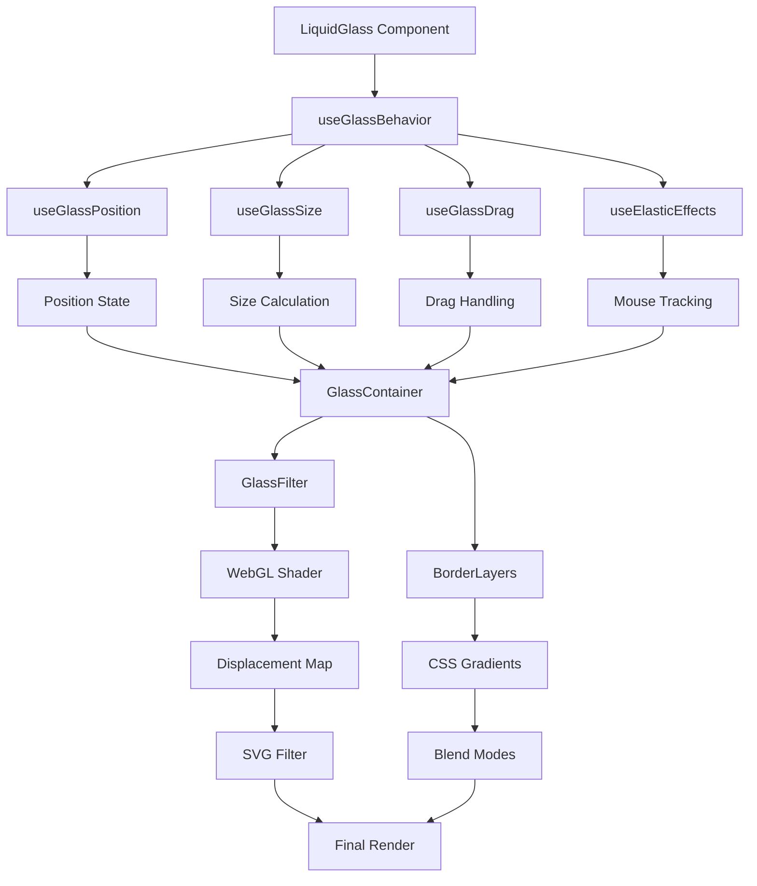

# Liquid Glass Component

A sophisticated TypeScript/React component that creates stunning glassmorphism effects with WebGL-powered displacement mapping, interactive drag behavior, and responsive visual feedback.

## Badges


## Overview

The Liquid Glass component delivers production-ready glassmorphism effects with advanced WebGL displacement mapping, elastic animations, and intelligent user interactions. Features include drag-and-drop functionality, automatic content sizing, viewport constraints, and cross-platform compatibility with SSR support.

**Visual Preview:** *Animated demonstration would show a translucent glass panel with subtle displacement effects, smooth drag interactions, and responsive elastic animations that react to cursor movement.*

## Table of Contents

- [Installation](#installation)
- [Quick Start](#quick-start)
- [Directory Structure](#directory-structure)
- [API Reference](#api-reference)
- [Advanced Usage](#advanced-usage)
- [Accessibility](#accessibility)
- [Component Flow](#component-flow)
- [Contributing](#contributing)
- [References](#references)
- [License](#license)

## Installation

Copy the entire `liquid-glass` directory into your project's component folder:

```bash
# Copy the component files into your project
cp -r src/components/liquid-glass /path/to/your/project/src/components/
```

### Dependencies

Ensure your project has the following dependencies installed:

```json
{
  "react": "^18.0.0",
  "react-dom": "^18.0.0"
}
```

## Quick Start

```ts
import React from 'react';
import LiquidGlass from './components/liquid-glass';

function App() {
  return (
    <LiquidGlass
      mode="polar"
      draggable={true}
      displacementScale={30}
      blurAmount={0.1}
      cornerRadius={20}
      padding="24px 32px"
      onClick={() => console.log('Glass clicked!')}
    >
      <h2>Welcome to Liquid Glass</h2>
      <p>This content floats on a beautiful glass surface.</p>
    </LiquidGlass>
  );
}
```

## Directory Structure

```
src/components/liquid-glass/
├── index.tsx                    # Main component export
├── types.ts                     # TypeScript interfaces
└── impl/
    ├── interaction/             # User interaction systems
    │   ├── index.ts            # Interaction module exports
    │   └── impl/
    │       ├── useElasticEffects.ts     # Cursor-based animations
    │       ├── useGlassBehavior.ts      # Master interaction orchestrator
    │       ├── useGlassDrag.ts          # Drag-and-drop functionality
    │       ├── useGlassPosition.ts      # Position management
    │       ├── useGlassSize.ts          # Content-based sizing
    │       └── useMouseTracking.ts      # Global mouse tracking
    ├── layout/                  # Layout and styling utilities
    │   ├── index.ts            # Layout module exports
    │   └── impl/
    │       ├── useCSSVariables.ts       # CSS variable management
    │       └── utils.ts                 # Position/padding utilities
    └── rendering/               # Visual effects and WebGL
        ├── index.ts            # Rendering module exports
        ├── components/
        │   ├── border-layers.tsx        # Multi-layer border effects
        │   ├── glass-container.tsx      # Main glass container
        │   └── glass-filter.tsx         # SVG filter composition
        ├── shader-utils/        # WebGL shader management
        │   ├── index.ts
        │   └── impl/
        │       ├── webglConstants.ts    # Shader source code
        │       ├── webglShaderClass.ts  # Shader compilation
        │       └── webglUtilities.ts    # WebGL utilities
        └── shaders/            # Displacement map generation
            ├── index.ts
            └── impl/
                ├── create-data-url.ts   # Data URL creation
                └── getMap.ts            # WebGL map generation
```

## API Reference

### Primary Component Props

| Prop | Type | Default | Description |
|------|------|---------|-------------|
| `mode` | `'standard' \| 'polar' \| 'prominent'` | `'standard'` | Displacement effect style |
| `draggable` | `boolean` | `true` | Enable drag-and-drop functionality |
| `displacementScale` | `number` | `20` | WebGL displacement intensity (0-100) |
| `blurAmount` | `number` | `0.1` | Backdrop blur multiplier (0-1) |
| `saturation` | `number` | `150` | Color saturation percentage (0-300) |
| `aberrationIntensity` | `number` | `0` | Chromatic aberration strength (0-10) |
| `cornerRadius` | `number` | `20` | Border radius in pixels |
| `padding` | `string` | `'24px 32px'` | CSS padding for content |
| `overLight` | `boolean` | `false` | Optimize for light backgrounds |
| `active` | `boolean` | `true` | Enable elastic effects |
| `onClick` | `() => void` | `undefined` | Click event handler |

### Type Definitions

```ts
interface IGlassPosition {
  x: number;           // Horizontal position in pixels
  y: number;           // Vertical position in pixels  
  centered: boolean;   // Enable centered positioning
}

interface IGlassSize {
  width: number;       // Panel width in pixels
  height: number;      // Panel height in pixels
}

interface IMousePosition {
  x: number;           // Mouse X coordinate
  y: number;           // Mouse Y coordinate
}
```

### Internal Algorithm

The liquid glass effect combines multiple rendering techniques:

1. **WebGL Displacement Generation**: Creates displacement maps using fragment shaders with three modes:
   - `standard`: Linear gradient displacement
   - `polar`: Radial distortion with angular variations
   - `prominent`: Enhanced center-focused effects

2. **SVG Filter Composition**: Applies displacement maps via SVG filters with optional chromatic aberration

3. **Backdrop Filtering**: Browser-native backdrop blur with saturation adjustments

4. **Position Constraints**: Maintains panel within viewport bounds using `constrainPosition(x, y, width, height, offset)`

5. **Elastic Animation**: RAF-based interpolation between mouse positions using `lerp(current, target, 0.15)`

## Advanced Usage

### Custom Theming

```ts
// CSS Variables for theming
:root {
  --glass-blur-amount: 10px;
  --glass-saturation: 150%;
  --glass-shadow-intensity: 0.3;
  --glass-border-opacity: 0.2;
}

// Override via CSS-in-JS
<LiquidGlass 
  style={{
    '--glass-blur-amount': '15px',
    '--glass-saturation': '200%'
  }}
>
```

### Performance Optimization

```ts
// Disable expensive effects on mobile
const isMobile = window.innerWidth < 768;

<LiquidGlass
  displacementScale={isMobile ? 0 : 30}
  active={!isMobile}
  aberrationIntensity={isMobile ? 0 : 3}
>
```

### Server-Side Rendering

```ts
// SSR-safe initialization
const [isClient, setIsClient] = useState(false);

useEffect(() => {
  setIsClient(true);
}, []);

return (
  <LiquidGlass
    mode={isClient ? 'polar' : 'standard'}
    displacementScale={isClient ? 30 : 0}
  >
    {children}
  </LiquidGlass>
);
```

## Accessibility

The component implements several accessibility features:

- **Keyboard Navigation**: Drag functionality respects form control focus
- **Screen Reader Support**: Maintains semantic HTML structure
- **Reduced Motion**: Respects `prefers-reduced-motion` for animations
- **High Contrast**: Adjusts effects based on system contrast preferences

```ts
// Accessibility-aware configuration
<LiquidGlass
  draggable={!window.matchMedia('(prefers-reduced-motion: reduce)').matches}
  displacementScale={window.matchMedia('(prefers-contrast: high)').matches ? 0 : 30}
>
```

## Component Flow



## Contributing

### Development Setup

```bash
# Install dependencies
npm install

# Run development server
npm run dev

# Run tests
npm run test

# Type checking
npm run type-check

# Linting
npm run lint

# Build for production
npm run build
```

### Code Standards

- **TypeScript**: Strict mode with comprehensive JSDoc comments
- **Testing**: Jest with React Testing Library
- **Linting**: ESLint with Prettier integration
- **Performance**: Bundle size monitoring with webpack-bundle-analyzer

### Pull Request Process

1. Fork the repository and create a feature branch
2. Add tests for new functionality
3. Ensure all tests pass and types are valid
4. Update documentation for API changes
5. Submit PR with detailed description

## References

- [WebGL Displacement Mapping Techniques](https://developer.mozilla.org/en-US/docs/Web/API/WebGL_API)
- [CSS Backdrop Filter Specification](https://drafts.fxtf.org/filter-effects-2/#backdrop-filter-property)
- [Glassmorphism Design Principles](https://uxdesign.cc/glassmorphism-in-user-interfaces-1f39bb1308c9)
- [React Performance Optimization](https://react.dev/learn/render-and-commit)
- [Accessibility Guidelines (WCAG)](https://www.w3.org/WAI/WCAG21/quickref/)

## License

MIT License - see LICENSE file for details.

Copyright (c) 2024 Liquid Glass Component Contributors